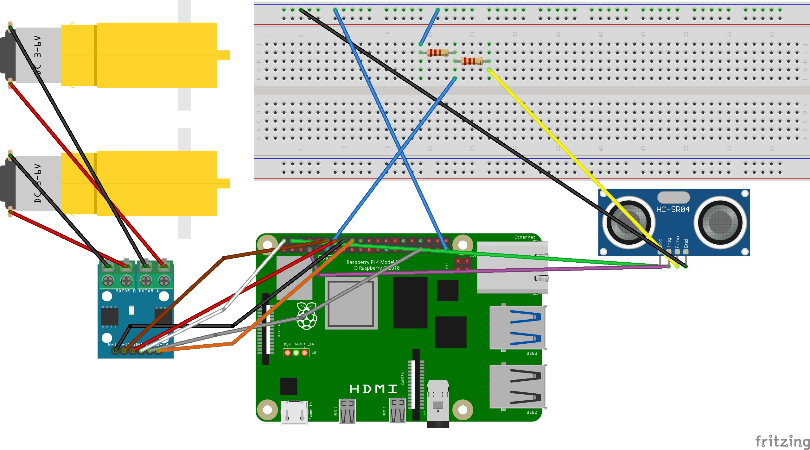

# Ball Tracking Robot 
A self-driving robot controlled by a Raspberry Pi 4 on 3 wheels, and propelled by 2 motors. It uses a Pi camera to detect and steer towards the designated red ball, and uses 3 pairs of Adafruit ultrasonic sensors to detect the distance from the ball. 

<!---Replace this text with a brief description (2-3 sentences) of your project. This description should draw the reader in and make them interested in what you've built. You can include what the biggest challenges, takeaways, and triumphs from completing the project were. As you complete your portfolio, remember your audience is less familiar than you are with all that your project entails! 

You should comment out all portions of your portfolio that you have not completed yet, as well as any instructions: --> 

| **Engineer** | **School** | **Area of Interest** | **Grade** |
|:--:|:--:|:--:|:--:|
| Kyuhyun K | Leigh High School | Software Engineering | Incoming Sophomore 

<!--**Replace the BlueStamp logo below with an image of yourself and your completed project. Follow the guide [here](https://tomcam.github.io/least-github-pages/adding-images-github-pages-site.html) if you need help.** -->

<!-- 
  
# Final Milestone

**Don't forget to replace the text below with the embedding for your milestone video. Go to Youtube, click Share -> Embed, and copy and paste the code to replace what's below.**

<iframe width="560" height="315" src="https://www.youtube.com/embed/F7M7imOVGug" title="YouTube video player" frameborder="0" allow="accelerometer; autoplay; clipboard-write; encrypted-media; gyroscope; picture-in-picture; web-share" allowfullscreen></iframe>

For your final milestone, explain the outcome of your project. Key details to include are: 
- What you've accomplished since your previous milestone
- What your biggest challenges and triumphs were at BSE
- A summary of key topics you learned about
- What you hope to learn in the future after everything you've learned at BSE


# Second Milestone

**Don't forget to replace the text below with the embedding for your milestone video. Go to Youtube, click Share -> Embed, and copy and paste the code to replace what's below.**

<iframe width="560" height="315" src="https://www.youtube.com/embed/y3VAmNlER5Y" title="YouTube video player" frameborder="0" allow="accelerometer; autoplay; clipboard-write; encrypted-media; gyroscope; picture-in-picture; web-share" allowfullscreen></iframe>

For your second milestone, explain what you've worked on since your previous milestone. You can highlight:
- Technical details of what you've accomplished and how they contribute to the final goal
- What has been surprising about the project so far
- Previous challenges you faced that you overcame
- What needs to be completed before your final milestone 
--> 

# First Milestone

<!--**Don't forget to replace the text below with the embedding for your milestone video. Go to Youtube, click Share -> Embed, and copy and paste the code to replace what's below.**

<iframe width="560" height="315" src="https://www.youtube.com/embed/CaCazFBhYKs" title="YouTube video player" frameborder="0" allow="accelerometer; autoplay; clipboard-write; encrypted-media; gyroscope; picture-in-picture; web-share" allowfullscreen></iframe>
--> 
For your first milestone, describe what your project is and how you plan to build it. You can include:
- An explanation about the different components of your project and how they will all integrate together
- Technical progress you've made so far
- Challenges you're facing and solving in your future milestones 
- What your plan is to complete your project 


## Code for testing components 

**Motors** 
```python 
from gpiozero import Motor 
import time 

rmotor = Motor(18, 23) 
lmotor = Motor(13,24) 

rmotor.backward() 
lmotor.forward() 
time.sleep(2) 
rmotor.reverse() 
lmotor.reverse() 
time.sleep(2) 
lmotor.stop() 
rmotor.stop() 
```

**Ultrasonic Sensor** 
```
from gpiozero import DistanceSensor 
ultrasonic = DistanceSensor(echo = 17, trigger = 4) 

#Only use one of these while loops at a time and comment out the other one 
while True: 
    print(ultrasonic.distance) 

while True:
      ultrasonic.wait_for_in_range()
      print("In range")
      ultrasonic.wait_for_out_of_range()
      print("Out of range") 
```

**Camera** 
```
from picamera2 import Picamera2
import cv2
import time 

# Initialize and configure the camera 
picam2 = Picamera2()
picam2.configure(picam2.create_preview_configuration(main={"format": "RGB888", "size": (640, 480)}))
picam2.start()
time.sleep(0.5) 

# Capture one frame
frame = picam2.capture_array() 
if frame is None or frame.size == 0:
    raise ValueError("Empty frame captured!") 

# Convert from RGB to BGR for OpenCV compatibility
frame = cv2.cvtColor(frame, cv2.COLOR_RGB2BGR)

# Save to file
cv2.imwrite("frame.jpg", frame) 
picam2.close() 

print("Frame saved as frame.jpg") 
``` 


## Schematic 
 


# Bill of Materials

| **Part** | **Note** | **Price** | **Link** |
|:--:|:--:|:--:|:--:|
| Raspberry Pi Kit | What the item is used for | $95.19 | <a href="https://www.amazon.com/RasTech-Raspberry-Starter-Heatsink-Screwdriver/dp/B0C8LV6VNZ/ref=sr_1_4?crid=3506HY00MCGVM&dib=eyJ2IjoiMSJ9._zkM62vSQ8p7tNr88715LdMv_qHh72Je-tkF9PXEa3chDE53QT4aZu4AGAb4ihE61QY4ZD55nKF6Fp2Kfs8t7AbafM_JrlJFfHo9OB4eAVGqa0EB-7aoBQHPmhKHZ2MW8ny-Kd44bMVlVxPlTWVk5YHIN5P3uKVqrE5Dcal0rKkHny-O6Xyb5ux2AOU6OwVbkag_bqBX66RQNRrgBuz-0pS43mcx93IZTQA9R8NaJJypYU2HAycp-XicTFmyU60a01Nfm9iuyo6B9yA8ppN3OQQyJ-NQ9xyNPxfTLwkqtng.yAYpU6outhQcZmOZhN9Wb6yTw7A85CNUbXZguGInZNg&dib_tag=se&keywords=raspberry%2Bpi%2Bkit&qid=1718848547&s=electronics&sprefix=rasbperry%2Bpi%2Bkit%2Celectronics%2C83&sr=1-4&th=1"> Link </a> | 
| Robot Chassis | What the item is used for | $18.99 | <a href="https://www.amazon.com/Smart-Chassis-Motors-Encoder-Battery/dp/B01LXY7CM3/ref=sr_1_5?crid=373Y5YK6JWMD&keywords=robot+chassis&qid=1687740144&sprefix=robot+chassi%2Caps%2C93&sr=8-5"> Link </a> |
| Screwdriver Kit | What the item is used for | $5.94 | <a href="https://www.amazon.com/Small-Screwdriver-Set-Mini-Magnetic/dp/B08RYXKJW9/"> Link </a> |
| Ultrasonic Sensor | What the item is used for | $9.99 | <a href="https://www.amazon.com/WWZMDiB-HC-SR04-Ultrasonic-Distance-Measuring/dp/B0CQCCGXCP/ref=sr_1_1_sspa?crid=3J2JR973WKPHO&dib=eyJ2IjoiMSJ9.E2SIkElJhtFWCJCHL5Q6Y73Ys_HCMPRVFCIrG_zKv4Og7BdZNtr69Mkju140lhlfzFGQuY542jpsp8FMrtV9d2hCBI7D8lYTH9bcgDXZhs4941uj-d1D69ZYdKmAI1Jig3VmYXOl3axVQ8Jq5L3nGRymNMtNbxkaFqGNyzkq4p37hhxU6jheuoaMo3Onz2FE9ILThkjUbdxRNW3rrZgZ7bYj9mf-yav85hBAmNduYyo.EneY3GmHDfDjDwhdUdDQ4Ktk6fECH62Adb42cEkehRc&dib_tag=se&keywords=ultrasonic%2Bsensor&qid=1715961326&sprefix=ultrasonic%2Bsensor%2Caps%2C72&sr=8-1-spons&sp_csd=d2lkZ2V0TmFtZT1zcF9hdGY&th=1"> Link </a> |
| H Bridges | What the item is used for | $8.99 | <a href="https://www.amazon.com/ACEIRMC-Stepper-Controller-2-5-12V-H-Bridge/dp/B0923VMKSZ/"> Link </a> |
| Pi Cam | What the item is used for | $12.86 | <a href="https://www.amazon.com/gp/product/B07RWCGX5K/ref=ox_sc_act_title_1?smid=A2IAB2RW3LLT8D&psc=1"> Link </a> | 
| Electronics Kit | What the item is used for | $11.98 | <a href="https://www.amazon.com/EL-CK-002-Electronic-Breadboard-Capacitor-Potentiometer/dp/B01ERP6WL4/ref=sr_1_4?crid=30T5LTYVQLQ7Z&dib=eyJ2IjoiMSJ9.XZtpck6Llt4UIuYeKM4X3BoXzDuzolZMTCtFDj-oTh1vuIi0HYJZJEdpS-MCdGCK1AWUbUmgoEswoRPxGUSKeGRTzsciRE_l2Vrp8FGX1SxK-HmibPNyHBEtkFJKo_OYmMhkhdCJ4OIH38ALRfFvrXZ7OU5faZVvkTBqod8p7UZYwNwdLCcimwFWGWKaDa-gbbx_TGk7lYQmEbrzeL4UXM-gW3RDtuOV0dCykxwyvYJKCCcOhrK3f18N4NZjiqL_Y5noE1rQTmwyFcG67DzgpNaUPanwIQaYfCe5mgD-njY.v6mU1wYX4M5ShCiyrZMey0hbOwvqLszD8axpHbKlA6I&dib_tag=se&keywords=mini+breadboard+kit&qid=1716419767&s=electronics&sprefix=mini+breadboard+kit%2Celectronics%2C106&sr=1-4"> Link </a> |
| Motors | What the item is used for | $11.98 | <a href="https://www.amazon.com/AEDIKO-Motor-Gearbox-200RPM-Ratio/dp/B09N6NXP4H/ref=sr_1_4?crid=1JP29NIWBLH2M&dib=eyJ2IjoiMSJ9.Wq3jKgOLbqtEP772vMD4pV5f-w3PLBdEpKqguykXOb0JFO14f4Dq0m_VDVUMUFtR8WFINUEticI3GXcoGqwXPqK9yIh04PhCktgccMz9zAUiKXMJPwmOTUp_6av3XuFD0lXo9WngN9iKI6YgZrhEEs9qnqbcB1GnvgntCdKz8Q1dFuNu61NgSE6Z8vBk3FRpaNcr1lCI7FApTiNi0Qce8gbfmMn6oUggZQHpIOKKZ6s.M7WsZ_ZZtm3rm93kKgw0NOxt1McVBYX6m55oGxu1xxI&dib_tag=se&keywords=dc+motor+with+gearbox&qid=1715911706&sprefix=dc+motor+with+gearbox%2Caps%2C126&sr=8-4"> Link </a> |
| SD Card Adapter | What the item is used for | $9.99 | <a href="https://www.amazon.com/dp/B081VHSB2V?ref=ppx_yo2ov_dt_b_fed_asin_title&th=1"> Link </a> |
| DMM | What the item is used for | $11 | <a href="https://www.amazon.com/AstroAI-Digital-Multimeter-Voltage-Tester/dp/B01ISAMUA6/ref=sxin_17_pa_sp_search_thematic_sspa?content-id=amzn1.sym.e8da13fc-7baf-46c3-926a-e7e8f63a520b%3Aamzn1.sym.e8da13fc-7baf-46c3-926a-e7e8f63a520b&cv_ct_cx=digital+multimeter&dib=eyJ2IjoiMSJ9.5LQumrfBR8l0mKnJCJlRg73dxpou0gqYD_ffU3srgs0Utegwth8GcQCSVXVzeZeLSJx5J3itz5TLdmJHsrVITQ.-00jRPoT-bBy26YC4LzQ-S4cYdztgmSMGb83_WEm6HY&dib_tag=se&keywords=digital+multimeter&pd_rd_i=B01ISAMUA6&pd_rd_r=e1ff2570-7e4a-4906-bc55-6f819d48d1bc&pd_rd_w=h7HgL&pd_rd_wg=0ZcFH&pf_rd_p=e8da13fc-7baf-46c3-926a-e7e8f63a520b&pf_rd_r=R6YKX3NXTDQ1PQP4H8RM&qid=1715911879&sbo=RZvfv%2F%2FHxDF%2BO5021pAnSA%3D%3D&sr=1-1-7efdef4d-9875-47e1-927f-8c2c1c47ed49-spons&sp_csd=d2lkZ2V0TmFtZT1zcF9zZWFyY2hfdGhlbWF0aWM&psc=1"> Link </a> |
| Champion sports ball | What the item is used for | $16.73 | <a href="https://www.amazon.com/Champion-Sports-Inch-Coated-Density/dp/B000KYTTYO/ref=sr_1_2_sspa?dib=eyJ2IjoiMSJ9.TLCeZ2jjYwnvK3RiJf14C4RstYOZXhRWTRbHkmLGiNfm5Vd8mVjvtsbUnBFk0S4d6cW9cPT7XDdhwMcPC30nsNwer7Uim0JVF49R8Od82u3RH4TY4mO1uP5LtqdvIEcW7CaOm7AzQ6xOvWQ4say1Ci9eGOxETDRWJP5rewLnqARbrvbe4kh-b2d5NHCLEsarPl16pM1UVlmQCXfMRksXigf_GpckmWPjeUM1AC8iiU0.lGUWr3-ZcZJNl0nJ2JaU6JEUOF9oR26lf0kUvETdmtM&dib_tag=se&keywords=7+inch+red+ball&qid=1748284272&sr=8-2-spons&sp_csd=d2lkZ2V0TmFtZT1zcF9hdGY&psc=1"> Link </a> |
| AA batteries | What the item is used for | $18.74 | <a href="https://www.amazon.com/Duracell-Coppertop-AA-Ingredients-Long-lasting/dp/B0035LCFNQ/ref=sr_1_2_sspa?crid=2YR65MVXWA50C&dib=eyJ2IjoiMSJ9.Y7LKJBX-6tZ05fw4EcW76nu14zklVu0uDSTwj-0-cV44GfYvoaYnLKVwcPIB1rWt_qVnpkZnwoqkvrQmMFQ1qiTWN_rokxCgCagwBWaAIiv9PAbMqrwOrkGuvfWfklSZi5Y9W6AaUUspAaSMBZuUyS4cUoJB-s35FE-4seDyYIxfOaNAZggr154hcf3CR015QRyanTdKe1P3g2-fihntxqYoU2ek7H01s8toH4MNd-E.Mnyne8z1KkhvfDMnfFLgjUB9WgjdkdMcYRL591Pngbk&dib_tag=se&keywords=aa+batteries&qid=1748284893&refinements=p_85%3A2470955011&refresh=1&rnid=2470954011&rps=1&sprefix=aa+batterie%2Caps%2C122&sr=8-2-spons&sp_csd=d2lkZ2V0TmFtZT1zcF9hdGY&psc=1"> Link </a> |
| USB power bank & cable | What the item is used for | $16.19 | <a href="https://www.amazon.com/SIXTHGU-Portable-Charger-Charging-Flashlight/dp/B0C7PHKKNK/ref=sr_1_2_sspa?crid=2ZZM4AAZMMWHQ&dib=eyJ2IjoiMSJ9.W2Zx5_I3mKOn6UpwAzOw6PD0PNh1iaMRBiedequdv9weeWL0HPyPcxJBR9h6-LiFW-sHKnHSApN0sUxx0Q9xIRs80R57IlvvCsmEzXcktogo-4nP-NxrEZOy5dJTcXY8N-PBwfGt4fl_9LP8npenzDUV9TPA8KN6DMu175g6JegC_gZhAJrbqX94EfpQhLwP9vIJH45w2N-AFrfZZOy9jqk55gzVyk4Qst8uZvqn768.KBrc5_SqZ4e8zCpoFc-1C7rk02t3o2ykgDPB65W5JJU&dib_tag=se&keywords=always%2Bon%2Bpower%2Bbank&qid=1715957917&sprefix=always%2Bon%2Bpower%2Bbank%2Caps%2C107&sr=8-2-spons&sp_csd=d2lkZ2V0TmFtZT1zcF9hdGY&th=1"> Link </a> |

<!--# Other Resources/Examples
One of the best parts about Github is that you can view how other people set up their own work. Here are some past BSE portfolios that are awesome examples. You can view how they set up their portfolio, and you can view their index.md files to understand how they implemented different portfolio components.
- [Example 1](https://trashytuber.github.io/YimingJiaBlueStamp/)
- [Example 2](https://sviatil0.github.io/Sviatoslav_BSE/)
- [Example 3](https://arneshkumar.github.io/arneshbluestamp/)
--> 

