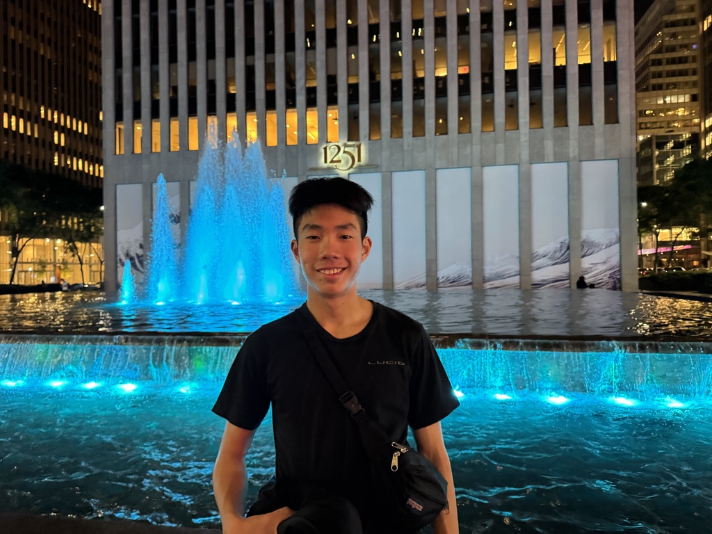
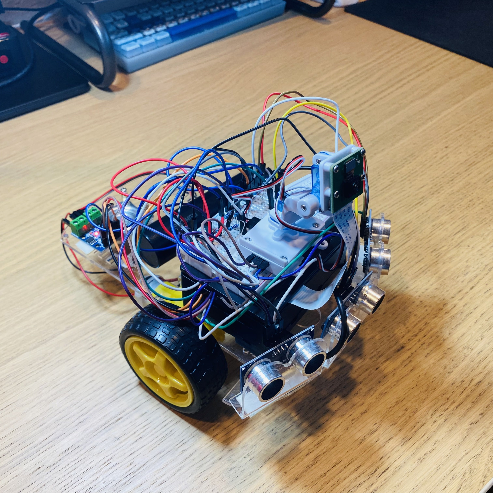
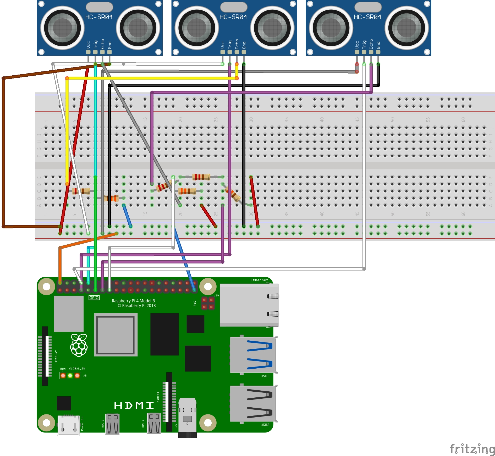

**About Me** 

 

Hi, I'm Kyuhyun and I'm a rising sophomore at Leigh High School. Before starting this project, I had limited hands-on engineering experience but had an interest in building my own project. I picked this project because it consisted of similar amounts of mechanical and software aspects of engineering. 


**I introduce you to...** 

# Ball Tracking Robot 

My project is a ball tracking robot on 2 wheels controlled by a Raspberry Pi 4 that SSHs to my computer. The robot is equipped with a Pi camera and 3 ultrasonic sensors to display a live feed & measure distance to the red ball, and utilizes a PID control program to steer itself toward the red ball. The entire robot is powered by a power bank, and it moves using 2 wheels attached to 2 AC motors. 

<!--A self-driving robot controlled by a Raspberry Pi 4 on 3 wheels, and propelled by 2 motors. It uses a Pi camera to detect and steer towards the designated red ball, and uses 3 pairs of Adafruit ultrasonic sensors to detect the distance from the ball. 

Replace this text with a brief description (2-3 sentences) of your project. This description should draw the reader in and make them interested in what you've built. You can include what the biggest challenges, takeaways, and triumphs from completing the project were. As you complete your portfolio, remember your audience is less familiar than you are with all that your project entails!  

You should comment out all portions of your portfolio that you have not completed yet, as well as any instructions: --> 

| **Engineer** | **School** | **Area of Interest** | **Grade** | 
|:--:|:--:|:--:|:--:|
| Kyuhyun K | Leigh High School | Software Engineering | Incoming Sophomore 

<!--**Replace the BlueStamp logo below with an image of yourself and your completed project. Follow the guide [here](https://tomcam.github.io/least-github-pages/adding-images-github-pages-site.html) if you need help.** -->

 


# Final Milestone - Wrap-up 
<!-- 
**Don't forget to replace the text below with the embedding for your milestone video. Go to Youtube, click Share -> Embed, and copy and paste the code to replace what's below.**

<iframe width="560" height="315" src="https://www.youtube.com/embed/F7M7imOVGug" title="YouTube video player" frameborder="0" allow="accelerometer; autoplay; clipboard-write; encrypted-media; gyroscope; picture-in-picture; web-share" allowfullscreen></iframe>

For your final milestone, explain the outcome of your project. Key details to include are: 
- What you've accomplished since your previous milestone
- What your biggest challenges and triumphs were at BSE
- A summary of key topics you learned about
- What you hope to learn in the future after everything you've learned at BSE 
--> 

<iframe src="https://www.youtube.com/embed/nqJw9iCZrxc?rel=0" style="top: 0; left: 0; width: 100%; height: 100%; position: absolute; border: 0;" allowfullscreen scrolling="no" allow="accelerometer *; clipboard-write *; encrypted-media *; gyroscope *; picture-in-picture *; web-share *;"></iframe></div>

My final milestone will mostly serve as a recap of everything I have accomplished as I was building this project, since there aren't as many additions compared to previous milestones. 
As an additional component, I also installed and connected a set of servomotors that could pan the camera left and right, and angle it up or down, depending on where it is. The servomotor made it so that the robot could track the red ball no matter which direction it was facing from the robot. However, controlling the servomotor was not exactly a smooth process as the function library I used to program was in C, a language I am unfamiliar with. Thus, I had to figure out how to make a shared .so file from an .o file with the help of my instructor, which allowed me to use the functions in Python. 
Although I took upon this project without much relevant knowledge and couldn't get as much as done as other more skilled students, I've gotten so much hands-on experience for building circuits using breadboards and resistors. Before starting this project, I did not even know what SSH meant, but now I have the knowledge required to make my own projects using Python. 
One of the most useful concepts I've learned from coding my robot is PID control. Now I know how the control system behind many everyday devices such as robot vacuums, and self-driving vehicles. 
For my first self-driven engineering project, I can proudly say that the final product exceeded my expectations. 
With my newfound engineering experience, I know that I have what it takes to develop projects of my choice and modify them as I see fit. 


# Second Milestone 


<iframe width="560" height="315" src="https://www.youtube.com/embed/8J3m2el726Y?si=N-IOYyN9vgjUt5Ti" title="YouTube video player" frameborder="0" allow="accelerometer; autoplay; clipboard-write; encrypted-media; gyroscope; picture-in-picture; web-share" referrerpolicy="strict-origin-when-cross-origin" allowfullscreen></iframe> 

<br> 

For my second milestone, I completed the base project by attaching 2 more ultrasonic sensors in the front, sending a live video feed from my Pi camera to my computer, utilizing a prewritten program to detect the red ball, and using PID controls to steer the robot towards the ball. 
Although I was too ambitous and thought I could try coding the program for sphere recognition myself, Daniel recommended me that I use a premade program. 
I tweaked the code for the live feed to show a dot that marks the center of the ball, an outline around the ball, the offset in a numerical form, and  if the ball is on the left or the right side, or centered from the view of the camera. 
During class, I learned about PID(Proportional, Integral, Derivative) controls, which use 3 factors to steer the robot towards the direction of the ball. 
My instructor, Daniel wrote out the pseudocode for the controller, which laid out the foundation for me to write the PID controller in Python. 
The first iterations of the program did not work very well, as it simply made the robot turn left and right, but I found out that the robot was actually avoiding the red ball instead of facing it. 
After reversing some of the signs in the inequality and going through some trial and error by trying different values for the PID controller, I got the robot to track the ball at a reasonably fast pace. 
I also wanted the robot to stop and print out a message saying that the ball is found when it was close enough to the ball, so I used the 3 ultrasonic sensors to measure the distance between the ball and the robot. 
However, I ran into many errors due to my mistakes while wiring the sensors, and I had to first map out the circuit in Fritzing, and double check where each wire is leading to. 
I eventually got the sensors to work, and my base project was finished. 
Next, I will be adding modifications to my robot such as a servomotor for turning the camera, adding keyboard controls(WASD) to the program, and designing a 3D-printed case for the robot in CAD. 

## Final ball tracking code 

```python 
from flask import Flask, Response, render_template_string
from picamera2 import Picamera2 
from gpiozero import Motor, DistanceSensor 
import cv2 
import numpy as np 

c_ultrasonic = DistanceSensor(echo = 17, trigger = 4) 
l_ultrasonic = DistanceSensor(echo = 27, trigger = 15) 
r_ultrasonic = DistanceSensor(echo = 22, trigger = 14) 

rmotor = Motor(18, 23) 
lmotor = Motor(13,24) 
basespeed = 0.3 

kp = 0.00005 #proportionality constant 
kd = 0.000025 #derivative constant 
ki = 0 #integral constant 
iError = 0 
prevError = 0 

def PID(T, C): 
    global prevError 
    global iError 
    error = C - T 
    dError = error - prevError 
    prevError = error 
    iError += error 
    P = kp * error 
    I = ki * iError 
    D = kd * dError 
    return P + I + D 


app = Flask(__name__) 

# Initialize PiCam
picam2 = Picamera2()
picam2.configure(picam2.create_preview_configuration(main={"format": "RGB888", "size": (640, 480)}))
picam2.start()

FRAME_WIDTH = 640
CENTER_X = FRAME_WIDTH // 2

def track_red_ball(frame):
    hsv = cv2.cvtColor(frame, cv2.COLOR_BGR2HSV) 
    lower_red1 = np.array([0, 100, 100]) 
    upper_red1 = np.array([10, 255, 255])
    lower_red2 = np.array([160, 100, 100])
    upper_red2 = np.array([179, 255, 255])
    
    mask1 = cv2.inRange(hsv, lower_red1, upper_red1)
    mask2 = cv2.inRange(hsv, lower_red2, upper_red2)
    mask = cv2.bitwise_or(mask1, mask2)
    
    mask = cv2.erode(mask, None, iterations=2)
    mask = cv2.dilate(mask, None, iterations=2)

    contours, _ = cv2.findContours(mask, cv2.RETR_EXTERNAL, cv2.CHAIN_APPROX_SIMPLE)

    if contours:
        largest = max(contours, key=cv2.contourArea) 
        M = cv2.moments(largest)
        if M["m00"] > 0:
            cx = int(M["m10"] / M["m00"]) 
            cy = int(M["m01"] / M["m00"]) 
            offset = cx - CENTER_X 
            output = PID(cx, CENTER_X) 
            if basespeed + output > 1: 
                output = 1-basespeed 
            if -basespeed + output < -1: 
                output = basespeed - 1 

            if abs(offset) < 20: 
                if c_ultrasonic.distance < 0.1 or l_ultrasonic.distance < 0.15 or r_ultrasonic.distance < 0.15: 
                    lmotor.stop() 
                    rmotor.stop() 
                    print("Ball Reached!") 
                else: 
                    lmotor.forward(speed = 0.5) 
                    rmotor.forward(speed = 0.5) 
            elif output > 0: 
                rmotor.forward(speed = basespeed + output) 
                lmotor.backward(speed = basespeed + output) 
            else: 
                lmotor.forward(speed = basespeed - output) 
                rmotor.backward(speed = basespeed - output) 
            

            if abs(offset) < 30: 
                position = "Centered" 
            elif offset < 0: 
                position = "Left" 
            else: 
                position = "Right" 

            cv2.drawContours(frame, [largest], -1, (0, 255, 0), 2) 
            cv2.circle(frame, (cx, cy), 5, (255,0,0), -1) 
            cv2.putText(frame, f"Offset: {offset} ({position})", (cx, cy - 20), 
            cv2.FONT_HERSHEY_SIMPLEX, 0.7, (255,255,255), 2) 

    return frame 

def generate_frames():
    while True:
        frame = picam2.capture_array()
        # frame = cv2.cvtColor(frame, cv2.COLOR_RGB2BGR)
        frame = track_red_ball(frame)
        ret, buffer = cv2.imencode('.jpg', frame)
        jpg_frame = buffer.tobytes()
        yield (b'--frame\r\n'
               b'Content-Type: image/jpeg\r\n'
               b'Content-Length: ' + f"{len(jpg_frame)}".encode() + b'\r\n\r\n' +
               jpg_frame + b'\r\n')
        
@app.route('/')
def index():
    return render_template_string('''
        <html>
            <head><title>Red Ball Tracking Stream</title></head>
            <body>
                <h2>Live Tracking</h2>
                
            </body>
        </html>
    ''')

@app.route('/video_feed')
def video_feed():
    return Response(generate_frames(),
                    mimetype='multipart/x-mixed-replace; boundary=frame')

if __name__ == '__main__':
    app.run(host='0.0.0.0', port=5000) 
``` 

## Schematic for the 3 ultrasonic sensors 
 

# First Milestone 

<iframe width="560" height="315" src="https://www.youtube.com/embed/cr8z1CbdYV4?si=1Jt48esQK1PJ1jZ9" title="YouTube video player" frameborder="0" allow="accelerometer; autoplay; clipboard-write; encrypted-media; gyroscope; picture-in-picture; web-share" referrerpolicy="strict-origin-when-cross-origin" allowfullscreen></iframe>  

<br> 

For my first milestone, I set up all the software parts of the base project, including the Raspberry Pi 4, and got my computer to remote SSH into it.  
On the mechanical side, I connected one of the ultrasonic sensors through a breadboard, 2 DC motors, and a Pi camera to my Raspberry Pi using the provided dupont wires.  
I got the motors to turn, print the distance detected by the ultrasonic sensor, and capture pictures through the Pi camera using the 3 programs listed below.  
My biggest challenge so far was getting the camera to take a photo, because at first I got a Segmentation Fault error, which was was extremely unsual to happen in Python, as pointed out by my helpful and patient instructor, Daniel Lin.  
After multiple attempts to uninstall and reinstall extensions, and reflashing the Pi, I finally got the camera to take a photo.  
Daniel also provided me with some code that converts the red parts of the image to white and the rest to black.  
The code is supposed to help distinguish the red ball from the rest of the environment. 
I reached this milestone at the end of my 1st week, and next week, I hope to finish the base project.  
That means I need to finish putting together the robot, and integrating the Pi camera into my program. 

## Code for testing components 

**Motors** 
```python 
from gpiozero import Motor 
import time 

rmotor = Motor(18, 23) 
lmotor = Motor(13,24) 

rmotor.backward() 
lmotor.forward() 
time.sleep(2) 
rmotor.reverse() 
lmotor.reverse() 
time.sleep(2) 
lmotor.stop() 
rmotor.stop() 
```

**Ultrasonic Sensor** 
```
from gpiozero import DistanceSensor 
ultrasonic = DistanceSensor(echo = 17, trigger = 4) 

#Only use one of these while loops at a time and comment out the other one 
while True: 
    print(ultrasonic.distance) 

while True:
      ultrasonic.wait_for_in_range()
      print("In range")
      ultrasonic.wait_for_out_of_range()
      print("Out of range") 
```

**Camera** 
```
from picamera2 import Picamera2
import cv2
import time 

# Initialize and configure the camera 
picam2 = Picamera2()
picam2.configure(picam2.create_preview_configuration(main={"format": "RGB888", "size": (640, 480)}))
picam2.start()
time.sleep(0.5) 

# Capture one frame
frame = picam2.capture_array() 
if frame is None or frame.size == 0:
    raise ValueError("Empty frame captured!") 

# Convert from RGB to BGR for OpenCV compatibility
frame = cv2.cvtColor(frame, cv2.COLOR_RGB2BGR)

# Save to file
cv2.imwrite("frame.jpg", frame) 
picam2.close() 

print("Frame saved as frame.jpg") 
``` 


## Schematic 
 


# Bill of Materials

| **Part** | **Note** | **Price** | **Link** |
|:--:|:--:|:--:|:--:|
| Raspberry Pi Kit | Remotely SSHs to desktop and runs all the code for the robot | $95.19 | <a href="https://www.amazon.com/RasTech-Raspberry-Starter-Heatsink-Screwdriver/dp/B0C8LV6VNZ/ref=sr_1_4?crid=3506HY00MCGVM&dib=eyJ2IjoiMSJ9._zkM62vSQ8p7tNr88715LdMv_qHh72Je-tkF9PXEa3chDE53QT4aZu4AGAb4ihE61QY4ZD55nKF6Fp2Kfs8t7AbafM_JrlJFfHo9OB4eAVGqa0EB-7aoBQHPmhKHZ2MW8ny-Kd44bMVlVxPlTWVk5YHIN5P3uKVqrE5Dcal0rKkHny-O6Xyb5ux2AOU6OwVbkag_bqBX66RQNRrgBuz-0pS43mcx93IZTQA9R8NaJJypYU2HAycp-XicTFmyU60a01Nfm9iuyo6B9yA8ppN3OQQyJ-NQ9xyNPxfTLwkqtng.yAYpU6outhQcZmOZhN9Wb6yTw7A85CNUbXZguGInZNg&dib_tag=se&keywords=raspberry%2Bpi%2Bkit&qid=1718848547&s=electronics&sprefix=rasbperry%2Bpi%2Bkit%2Celectronics%2C83&sr=1-4&th=1"> Link </a> | 
| Robot Chassis | Used as the base of the robot, holds all of the components together | $18.99 | <a href="https://www.amazon.com/Smart-Chassis-Motors-Encoder-Battery/dp/B01LXY7CM3/ref=sr_1_5?crid=373Y5YK6JWMD&keywords=robot+chassis&qid=1687740144&sprefix=robot+chassi%2Caps%2C93&sr=8-5"> Link </a> |
| Screwdriver Kit | Has a variety of screwheads used for securing screws | $5.94 | <a href="https://www.amazon.com/Small-Screwdriver-Set-Mini-Magnetic/dp/B08RYXKJW9/"> Link </a> |
| Ultrasonic Sensor | Measures the distance between ball and robot | $9.99 | <a href="https://www.amazon.com/WWZMDiB-HC-SR04-Ultrasonic-Distance-Measuring/dp/B0CQCCGXCP/ref=sr_1_1_sspa?crid=3J2JR973WKPHO&dib=eyJ2IjoiMSJ9.E2SIkElJhtFWCJCHL5Q6Y73Ys_HCMPRVFCIrG_zKv4Og7BdZNtr69Mkju140lhlfzFGQuY542jpsp8FMrtV9d2hCBI7D8lYTH9bcgDXZhs4941uj-d1D69ZYdKmAI1Jig3VmYXOl3axVQ8Jq5L3nGRymNMtNbxkaFqGNyzkq4p37hhxU6jheuoaMo3Onz2FE9ILThkjUbdxRNW3rrZgZ7bYj9mf-yav85hBAmNduYyo.EneY3GmHDfDjDwhdUdDQ4Ktk6fECH62Adb42cEkehRc&dib_tag=se&keywords=ultrasonic%2Bsensor&qid=1715961326&sprefix=ultrasonic%2Bsensor%2Caps%2C72&sr=8-1-spons&sp_csd=d2lkZ2V0TmFtZT1zcF9hdGY&th=1"> Link </a> |
| H Bridges | Connects the motors to the Pi | $8.99 | <a href="https://www.amazon.com/ACEIRMC-Stepper-Controller-2-5-12V-H-Bridge/dp/B0923VMKSZ/"> Link </a> |
| Pi Cam | Mounted on the servomotor and is used to detect the red ball | $12.86 | <a href="https://www.amazon.com/gp/product/B07RWCGX5K/ref=ox_sc_act_title_1?smid=A2IAB2RW3LLT8D&psc=1"> Link </a> | 
| Electronics Kit | Contains breadboard and all kinds of wires required to make the robot function | $11.98 | <a href="https://www.amazon.com/EL-CK-002-Electronic-Breadboard-Capacitor-Potentiometer/dp/B01ERP6WL4/ref=sr_1_4?crid=30T5LTYVQLQ7Z&dib=eyJ2IjoiMSJ9.XZtpck6Llt4UIuYeKM4X3BoXzDuzolZMTCtFDj-oTh1vuIi0HYJZJEdpS-MCdGCK1AWUbUmgoEswoRPxGUSKeGRTzsciRE_l2Vrp8FGX1SxK-HmibPNyHBEtkFJKo_OYmMhkhdCJ4OIH38ALRfFvrXZ7OU5faZVvkTBqod8p7UZYwNwdLCcimwFWGWKaDa-gbbx_TGk7lYQmEbrzeL4UXM-gW3RDtuOV0dCykxwyvYJKCCcOhrK3f18N4NZjiqL_Y5noE1rQTmwyFcG67DzgpNaUPanwIQaYfCe5mgD-njY.v6mU1wYX4M5ShCiyrZMey0hbOwvqLszD8axpHbKlA6I&dib_tag=se&keywords=mini+breadboard+kit&qid=1716419767&s=electronics&sprefix=mini+breadboard+kit%2Celectronics%2C106&sr=1-4"> Link </a> |
| Motors | Makes the robot move | $11.98 | <a href="https://www.amazon.com/AEDIKO-Motor-Gearbox-200RPM-Ratio/dp/B09N6NXP4H/ref=sr_1_4?crid=1JP29NIWBLH2M&dib=eyJ2IjoiMSJ9.Wq3jKgOLbqtEP772vMD4pV5f-w3PLBdEpKqguykXOb0JFO14f4Dq0m_VDVUMUFtR8WFINUEticI3GXcoGqwXPqK9yIh04PhCktgccMz9zAUiKXMJPwmOTUp_6av3XuFD0lXo9WngN9iKI6YgZrhEEs9qnqbcB1GnvgntCdKz8Q1dFuNu61NgSE6Z8vBk3FRpaNcr1lCI7FApTiNi0Qce8gbfmMn6oUggZQHpIOKKZ6s.M7WsZ_ZZtm3rm93kKgw0NOxt1McVBYX6m55oGxu1xxI&dib_tag=se&keywords=dc+motor+with+gearbox&qid=1715911706&sprefix=dc+motor+with+gearbox%2Caps%2C126&sr=8-4"> Link </a> | 
| SD Card Adapter | Used to connect the SD card to desktop and download Raspberry Pi Os | $9.99 | <a href="https://www.amazon.com/dp/B081VHSB2V?ref=ppx_yo2ov_dt_b_fed_asin_title&th=1"> Link </a> |
| DMM | To be completely honest, I don't know why they sent this to me | $11 | <a href="https://www.amazon.com/AstroAI-Digital-Multimeter-Voltage-Tester/dp/B01ISAMUA6/ref=sxin_17_pa_sp_search_thematic_sspa?content-id=amzn1.sym.e8da13fc-7baf-46c3-926a-e7e8f63a520b%3Aamzn1.sym.e8da13fc-7baf-46c3-926a-e7e8f63a520b&cv_ct_cx=digital+multimeter&dib=eyJ2IjoiMSJ9.5LQumrfBR8l0mKnJCJlRg73dxpou0gqYD_ffU3srgs0Utegwth8GcQCSVXVzeZeLSJx5J3itz5TLdmJHsrVITQ.-00jRPoT-bBy26YC4LzQ-S4cYdztgmSMGb83_WEm6HY&dib_tag=se&keywords=digital+multimeter&pd_rd_i=B01ISAMUA6&pd_rd_r=e1ff2570-7e4a-4906-bc55-6f819d48d1bc&pd_rd_w=h7HgL&pd_rd_wg=0ZcFH&pf_rd_p=e8da13fc-7baf-46c3-926a-e7e8f63a520b&pf_rd_r=R6YKX3NXTDQ1PQP4H8RM&qid=1715911879&sbo=RZvfv%2F%2FHxDF%2BO5021pAnSA%3D%3D&sr=1-1-7efdef4d-9875-47e1-927f-8c2c1c47ed49-spons&sp_csd=d2lkZ2V0TmFtZT1zcF9zZWFyY2hfdGhlbWF0aWM&psc=1"> Link </a> |
| Champion sports ball | The red ball that the robot is supposed to track | $16.73 | <a href="https://www.amazon.com/Champion-Sports-Inch-Coated-Density/dp/B000KYTTYO/ref=sr_1_2_sspa?dib=eyJ2IjoiMSJ9.TLCeZ2jjYwnvK3RiJf14C4RstYOZXhRWTRbHkmLGiNfm5Vd8mVjvtsbUnBFk0S4d6cW9cPT7XDdhwMcPC30nsNwer7Uim0JVF49R8Od82u3RH4TY4mO1uP5LtqdvIEcW7CaOm7AzQ6xOvWQ4say1Ci9eGOxETDRWJP5rewLnqARbrvbe4kh-b2d5NHCLEsarPl16pM1UVlmQCXfMRksXigf_GpckmWPjeUM1AC8iiU0.lGUWr3-ZcZJNl0nJ2JaU6JEUOF9oR26lf0kUvETdmtM&dib_tag=se&keywords=7+inch+red+ball&qid=1748284272&sr=8-2-spons&sp_csd=d2lkZ2V0TmFtZT1zcF9hdGY&psc=1"> Link </a> |
| AA batteries | Replaced by the power bank | $18.74 | <a href="https://www.amazon.com/Duracell-Coppertop-AA-Ingredients-Long-lasting/dp/B0035LCFNQ/ref=sr_1_2_sspa?crid=2YR65MVXWA50C&dib=eyJ2IjoiMSJ9.Y7LKJBX-6tZ05fw4EcW76nu14zklVu0uDSTwj-0-cV44GfYvoaYnLKVwcPIB1rWt_qVnpkZnwoqkvrQmMFQ1qiTWN_rokxCgCagwBWaAIiv9PAbMqrwOrkGuvfWfklSZi5Y9W6AaUUspAaSMBZuUyS4cUoJB-s35FE-4seDyYIxfOaNAZggr154hcf3CR015QRyanTdKe1P3g2-fihntxqYoU2ek7H01s8toH4MNd-E.Mnyne8z1KkhvfDMnfFLgjUB9WgjdkdMcYRL591Pngbk&dib_tag=se&keywords=aa+batteries&qid=1748284893&refinements=p_85%3A2470955011&refresh=1&rnid=2470954011&rps=1&sprefix=aa+batterie%2Caps%2C122&sr=8-2-spons&sp_csd=d2lkZ2V0TmFtZT1zcF9hdGY&psc=1"> Link </a> |
| USB power bank & cable | Powers the robot | $16.19 | <a href="https://www.amazon.com/SIXTHGU-Portable-Charger-Charging-Flashlight/dp/B0C7PHKKNK/ref=sr_1_2_sspa?crid=2ZZM4AAZMMWHQ&dib=eyJ2IjoiMSJ9.W2Zx5_I3mKOn6UpwAzOw6PD0PNh1iaMRBiedequdv9weeWL0HPyPcxJBR9h6-LiFW-sHKnHSApN0sUxx0Q9xIRs80R57IlvvCsmEzXcktogo-4nP-NxrEZOy5dJTcXY8N-PBwfGt4fl_9LP8npenzDUV9TPA8KN6DMu175g6JegC_gZhAJrbqX94EfpQhLwP9vIJH45w2N-AFrfZZOy9jqk55gzVyk4Qst8uZvqn768.KBrc5_SqZ4e8zCpoFc-1C7rk02t3o2ykgDPB65W5JJU&dib_tag=se&keywords=always%2Bon%2Bpower%2Bbank&qid=1715957917&sprefix=always%2Bon%2Bpower%2Bbank%2Caps%2C107&sr=8-2-spons&sp_csd=d2lkZ2V0TmFtZT1zcF9hdGY&th=1"> Link </a> | 

